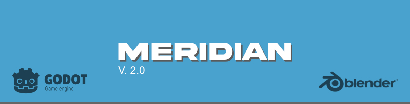
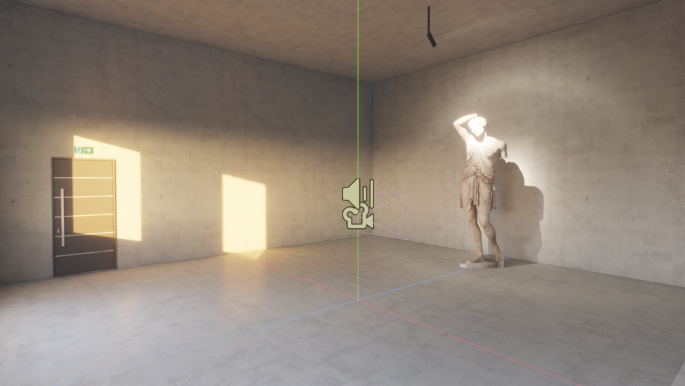
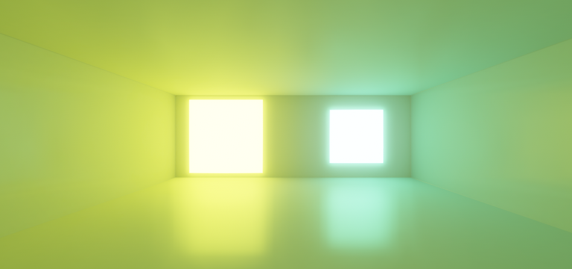
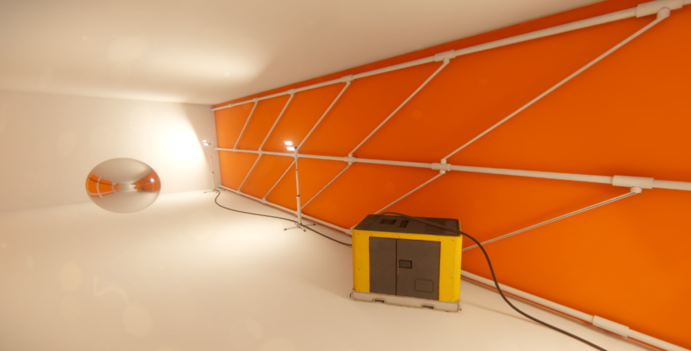
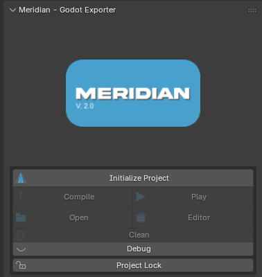
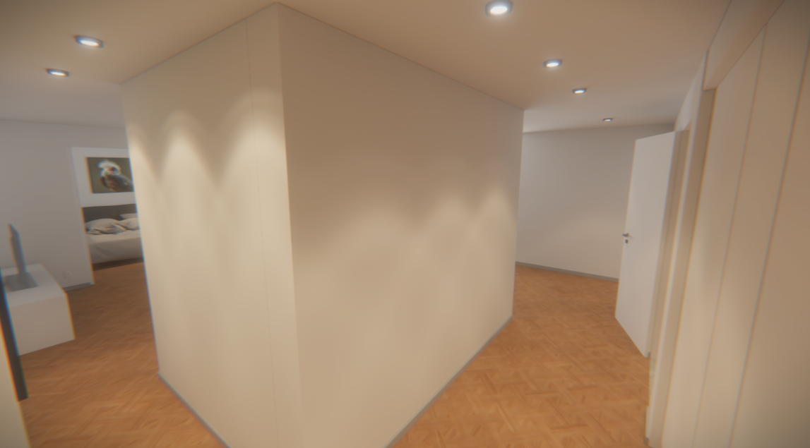
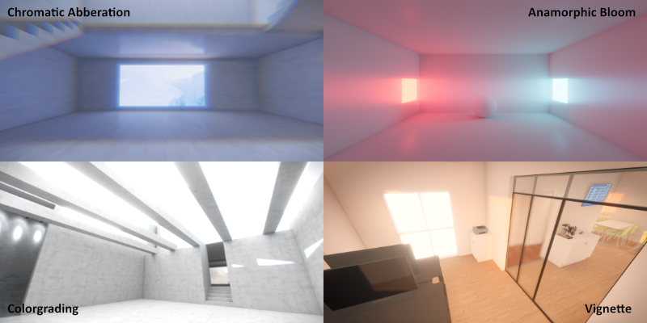

# Meridian 2.0 released
### From thought to reality in the fastest way possible!

Meridian is a free and open-source Blender addon that bridges Blender and Godot by turning your .blend file into a fully wired Godot project.

It's a little project I've been working on for a while to help me with my work as an airport engineer, but it's reached a stage where I thought it would be useful for others as well.

Essentially what it does, is taking everything from meshes, lighting, scripts, decals, reflection probes and more to Godot, in just one click.

## What is Meridian

Most Blender-to-Godot exporters stop at the mesh. You essentially just export a .glb file, drop it into Godot, then spend the next hour manually recreating your lights, setting up materials, wiring scripts and more.

Meridian handles the whole thing. It initializes a Godot project, compiles a scene files (.tscn) with all your objects, lights, cameras, probes, and decals already placed, converts your materials, bakes and imports your lightmaps (High-quality cycles bakes), and can even launch and play the result - all from inside Blender.

## What Makes Meridian Different
### Full scene compilation, not just mesh export
Meridian writes the Godot .tscn scene file directly. Cameras, lights, reflection probes, decals, collision shapes, render layers, and LOD settings are all exported as proper Godot nodes - not left for you to rebuild.

### One-click project initialization
Meridian creates a ready-to-run Godot project from scratch: project.godot, folder structure, renderer settings, anti-aliasing, scaling, and platform configuration. Switch to XR and it enables OpenXR and adjusts the physics tick rate automatically.

### Baked lightmap pipeline

Meridian integrates with newest version of The Lightmapper addon (another addon of mine, originally made for Armory3D). Bake in Blender, run Compile, and your HDR lightmaps are copied to the Godot project and automatically applied to the right mesh instances via a bundled Godot editor plugin and custom shaders — no manual assignment needed. 

### Postprocess effects

New postprocess effects included in Meridian:
- Chromatic Aberration: Simulate optical distortion for cinematic effects
- Vignette: Add focus and simulate natural light falloff
- Sharpen: Additional sharpening filters
- Colorgrading: High-quality colorgrading suite inspired by Unreal Engine
- Anamorphic Bloom: Want stretched bloom like Cyberpunk or Deus Ex? You've got it!

### LiveLink
Move, rotate, or scale any object in Blender and it updates in Godot instantly over a local socket connection. No re-export needed for layout and positioning work.

### Scripting
Attach GDScript files (custom or bundled) to any object directly in Blender's properties panel. Scripts are copied to your Godot project and wired to the correct nodes on export.

Additional bundled scripts including first-person flycam, orbitcam, movement, rotation and more is available for easy application.

### Material conversion
Principled BSDF materials are converted on export with configurable channel stripping (emission, normals, roughness) and an optional texture size cap - keeping the exported assets clean for your target platform.

### Auto-export on save
Enable Auto Export and every Ctrl+S in Blender pushes the latest mesh to your Godot project automatically. Again something that enables the rapid prototyping workflow that Meridian was made for.

### Platform targets
Configure your project for Desktop, XR (VR/AR), or Web from a single dropdown. Each platform configures the renderer, physics, and OpenXR settings appropriately.

### One-click publishing
Package your Godot project for Windows, Web, or Android from inside Blender using headless Godot export — with automatic export template management.

## What's included in version 2? - a brief recap

- Mesh export as .glb or .gltf + .bin
- Full .tscn scene file generation
- Cameras exported as Camera3D nodes
- Point, spot, and directional lights with shadows and render layers
- Reflection probes
- Decals
- Environment / sky export from Blender world settings
- World override support per-scene
- Export toggle (include/exclude individual objects)
- Collision shape type: Convex, Trimesh, Box, Sphere, Capsule
- Collision layer and mask
- Render layer bitmask
- LOD distances (2 levels)
- Script list (multiple scripts per object, enabled/disabled individually)
- The Lightmapper One addon integration
- Individual lightmap mode (per-object HDR textures via StandardPlusAuto shader)
- Bicubic filtering option
- Automatic copy and application
- Principled BSDF → StandardMaterial3D conversion
- Selective channel export (albedo, emission, normal, roughness)
- Per-export-run saved state — originals are restored after export
- Real-time transform synchronization (position, rotation, scale)
- Rendering Settings (written to project.godot)
- MSAA, TAA, screen-space AA, debanding
- 3D scaling mode and scale factor
- FSR settings
- SSAO, SSIL, SDFGI settings
- Glow, fog, depth of field, tone mapping settings
- Anamorphic bloom compositor effect (multi-pass, mip-chain, compute shader)
- Full project.godot generation with versioned config
- Boot splash and app icon support'
- Publish to Windows, Web, Android via headless Godot
- Automatic export template download if missing
- Clean project operator (removes generated files)

### Basic Workflow

1. **Initialize Project** — point Meridian at a folder, pick your platform and renderer, click **Initialize**. Godot project created.

2. **Build your scene** — model, light, and lay out everything in Blender as normal. Assign scripts, set collision types, configure probes.

3. **Compile** — one click exports the mesh, writes the .tscn, converts materials, and copies all assets.

4. **Play** — launches Godot and runs the scene immediately.

### Requirements and setup

| | |
|---|---|
| Blender | 4.5 or newer |
| Godot | 4.6 |
| OS | Windows, macOS, Linux |

Install it like any other addon, point to the Godot executable in the preferences settings.